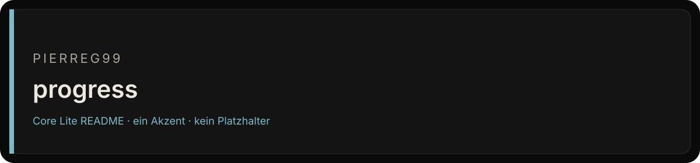
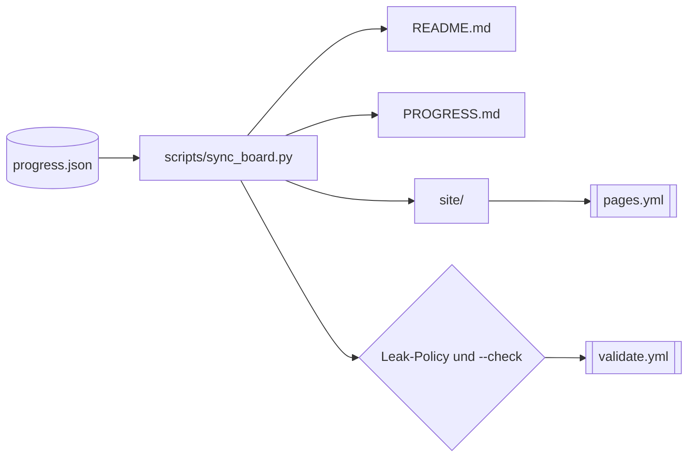

<div align="center">



# Cryo Progress (96%)

<p><strong>Öffentlicher Fortschritts- und Qualitätsstand von Cryo Omega, private Projekte nur unter Codenamen.</strong></p>

<p>


</p>
<p>
<a href="https://github.com/Pierreg99/progress/actions/workflows/validate.yml"></a>
<a href="https://github.com/Pierreg99/progress/actions/workflows/pages.yml"></a>
<a href="https://github.com/Pierreg99/progress/actions/workflows/account-sync.yml"></a>
</p>

<p><a href="#tracks">Tracks</a> · <a href="#schnellstart">Schnellstart</a> · <a href="#english-summary">English</a></p>

</div>

<table>
<tr>
<td width="58%" valign="top">

### Bestand

Public Cryo Omega progress % + quality audits (private projects by secret codename only)

Der Default-Branch `main` ist die Fläche, die zählt. Was nicht in diesem Baum liegt, ist kein Feature dieses Repos.

</td>
<td width="42%" valign="top">

### Fakten

| Feld | Wert |
| --- | --- |
| Owner | Pierreg99 |
| Branch | `main` |
| Sichtbarkeit | öffentlich |
| Sprache | HTML |
| Archiv | nein |

</td>
</tr>
</table>

---

## Inhaltsverzeichnis

- [Bestand und Fakten](#bestand)
- [Überblick](#überblick)
- [Features](#features)
- [Tracks](#tracks)
- [Schnellstart](#schnellstart)
- [Architektur](#architektur)
- [Projektstruktur](#projektstruktur)
- [Richtlinien](#richtlinien)
- [Dokumentation](#dokumentation)
- [English summary](#english-summary)

## Überblick

**Gesamt: 96%** · Stand: `2026-10-06T18:10:00+02:00` · Zeitzone: Europe/Berlin

Synchronisiert nach jeder relevanten Aufgabe (Skill `sync-progress-after-task`) sowie werktags über die Routine **Progress percent auto** (18:00 Berlin, Mo–Fr). Private Tracks erscheinen ausschließlich unter ihrem **Codenamen**.

## Features

- Eine Datenquelle: `progress.json` enthält alle Tracks; der Gesamtwert ist der Mittelwert aller Track-Prozente.
- `scripts/sync_board.py` erzeugt `README.md`, `PROGRESS.md` und die Seiten unter `site/`.
- Eingebaute Leak-Prüfung: Inhalte werden vor dem Schreiben auf private Repository-Namen geprüft.
- `--check` erkennt veraltete Artefakte; `validate.yml` prüft jeden Pull Request.
- Historie unter `history/`, Qualitäts-Audits unter `quality/audits/`, Benchmarks unter `benchmarks/`.
- Live-Board über GitHub Pages (`pages.yml`).

## Tracks

| % | Name | Status |
|---|------|--------|
| 100% | `AURORA-PANEL-27` | live |
| 100% | `Blender 5.2 LTS install` | live |
| 100% | `CRYO-ARC-14` | live |
| 100% | `Castle 30s immersive render` | live |
| 100% | `Chronicles of Lumina` | live |
| 100% | `CryAIPulse public viz` | live |
| 100% | `Cryoplane Polygonal Flight` | live |
| 100% | `Cyberdash Rhythm Platformer` | live |
| 100% | `DRIFT-MIRROR-11` | live |
| 100% | `IRON-SEAL-38` | live |
| 100% | `KiBlox VoxelGame` | live |
| 100% | `Master prompts fan bundle` | live |
| 100% | `NEXUS-SPIRE-42` | live |
| 100% | `OBSIDIAN-ORBIT-66` | live |
| 100% | `POLAR-BLADE-62` | live |
| 100% | `POLAR-BLADE-62` | live |
| 100% | `POLAR-BLADE-62` | live |
| 100% | `Resident Lovely` | live |
| 100% | `SPECTRE-LENS-37` | live |
| 100% | `agent-memory library` | live |
| 96% | `NEXUS-CORE-81` | active |
| 10% | `CIPHER-ARC-15` | user_action |

## Offen

- **CIPHER-ARC-15**: 10% (user_action), Secret rotation still deferred (codename only).
- **NEXUS-CORE-81**: 96% (active), main at 5297cea (README surfaces + OmniSurface CLI/TUI dispatcher, Termux:API catalog, skin registry, LSP host probe on top of 4c0a0b4); pytest 52 passed on 5297cea (2026-10-05). The botult branch no longer exists on the remote; 7 PRs open (checked 2026-10-06, main unchanged). Still no debugger or git panel in the IDE or APK and no live language-server session (kotlin-lsp binary not in the tree), so the percent stays 96.

## Schnellstart

```bash
git clone https://github.com/Pierreg99/progress.git
cd progress
python3 scripts/sync_board.py          # regenerate PROGRESS.md + README.md + site/
python3 scripts/sync_board.py --check  # CI / pre-push policy check
```

## Architektur



## Projektstruktur

```text
progress/
├── .github/workflows/   account-sync.yml, pages.yml, validate.yml
├── benchmarks/          Benchmark-Snapshots
├── codenames/           Öffentliche Aliase
├── data/                Account-Inventar und Meilensteine
├── docs/                Audits und Dokumentationsstandard
├── history/             Tägliche Fortschritts-Snapshots
├── quality/             QUALITY.md und Audits
├── scripts/             sync_board.py, sync_account_inventory.py
├── site/                Live-Board (GitHub Pages)
├── progress.json        Datenquelle
├── PROGRESS.md          Generierte Übersicht
├── README.de.md / README.en.md
└── LICENSE
```

## Richtlinien

- Niemals private Codename-Zuordnungen oder echte private Repository-Namen in Inhaltsdateien committen.
- Öffentliche Aliase liegen in [`codenames/PUBLIC_ALIASES.json`](./codenames/PUBLIC_ALIASES.json).
- Historien-Snapshots: [`history/`](./history/).
- Live-Board (GitHub Pages): `site/index.html`

## Dokumentation

- [README.de.md](./README.de.md) · [README.en.md](./README.en.md)
- [PROGRESS.md](./PROGRESS.md)
- [Qualität: quality/QUALITY.md](./quality/QUALITY.md)
- [Benchmarks: benchmarks/LATEST.md](./benchmarks/LATEST.md)
- [docs/](./docs/)

## English summary

Public Cryo Omega progress and quality audits. Overall progress is **96%** across 22 tracks (20 complete); private tracks appear by codename only. Everything is generated from `progress.json` by `scripts/sync_board.py`, which also enforces the private-name leak policy and powers the GitHub Pages board.
